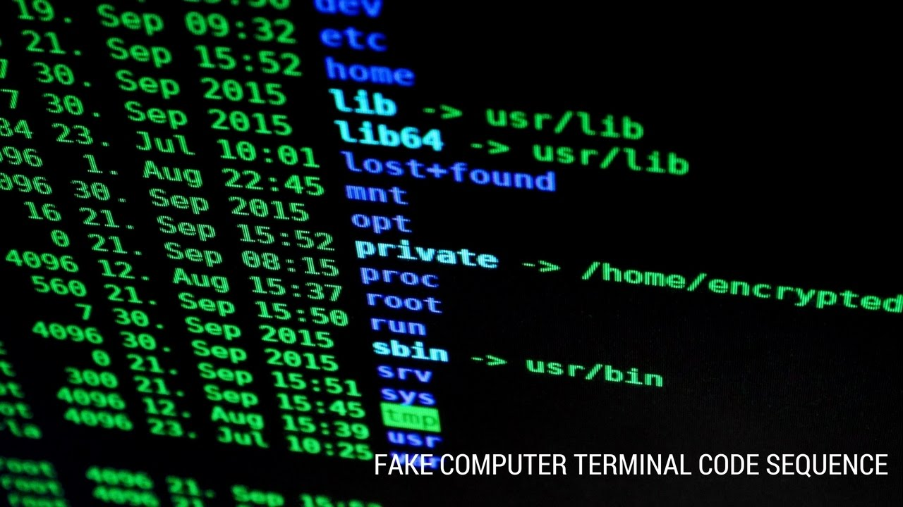
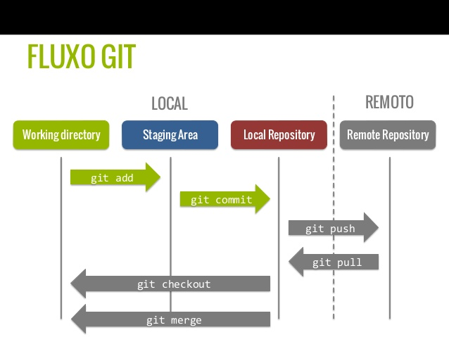
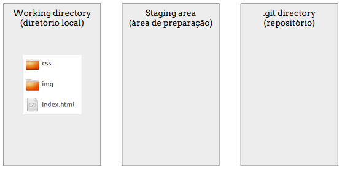
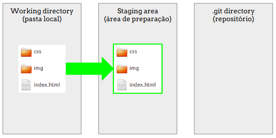
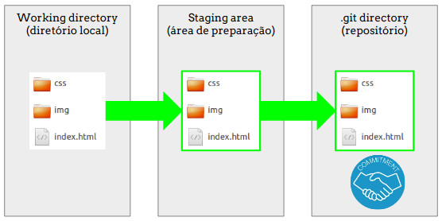
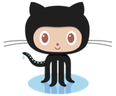
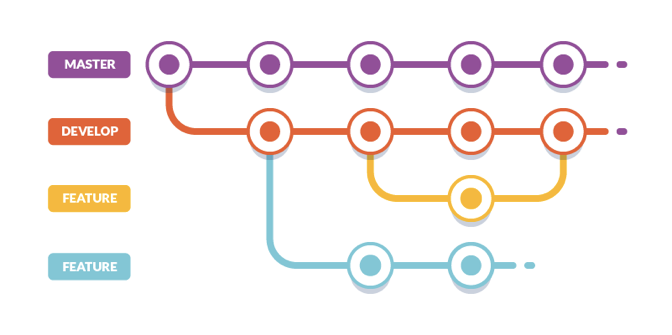
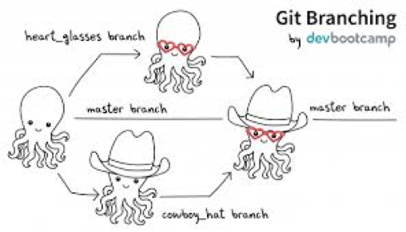
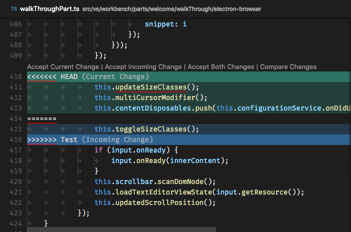
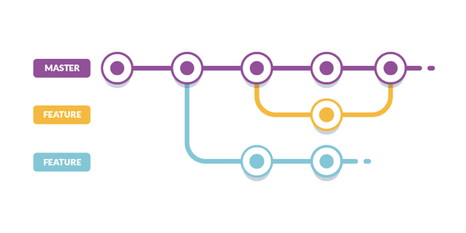

# Git e GitHub

* [O que é linha de comando e por que é importante?](#linha-comando)
* [Comandos básicos do terminal](#comandos-basicos)
* [O que é Git e por que é importante?](#git)
* [O que é Git Bash e por que é importante?](#gitbash)
* [Instalação do Git](#instalacao)
* [Configurações de autoria](#config-autoria)
* [De: Local - Para: Remoto](#local-remote)
* [Fluxo do git](#fluxo-do-git)
* [Branch](#branch)
* [Merge](#merge)
* [Pull request](#pull-request)
* [O que é GitHub e por que é importante?](#o-que-é-github)
* [Formas de trabalhar com o Git/GitHub](#formas-de-trabalhar-com-o-gitgithub)
* [Pra não esquecer:](#pra-nao-esquecer)
* [Etapas para trabalhar em um projeto distribuído](#etapas-projeto)
* [Extras](#extras)

***

### O que é linha de comando e por que é importante? <a name="linha-comando"></a>


É aquela tela preta que aparece nos filmes, normalmente com alguém hackeando algum sistema.
Mexer com o terminal assusta um pouco porque ele não é nem um pouco visual. Mas é muito simples mexer nele.
Sabe quando a gente arrasta arquivos para uma pasta ou cria uma pasta nova? No terminal você faz tudo isso também, mas sem interface gráfica. A gente insere comandos, e ele executa.

Na linha de comando você controla melhor o que está rolando com o seu computador - inclusive o versionamento. O git é sempre usado através de linha de comando. (Existem outras ferramentas visuais para uso do Git, mas é importante saber se virar pela linha de comando no dia-a-dia)

***

### Comandos básicos do terminal <a name="comandos-basicos"></a>

Esses comandos servem para para listar arquivos e navegar entre pastas dentro do computador.

```
ls - Listar (ele traz uma lista de tudo o que está naquela pasta - documentos, outras pastas, etc)
pwd - Present working directory (onde estou?) Ele traz todo o caminho onde você está (em que pasta e onde essa pasta fica)
cd - change directory (use para se locomover entre as pastas)
cd ~ - volta para a pasta raiz
cd . - volta uma pasta acima
cd nome-da-pasta - para entrar em uma pasta específica (você precisa conseguir enxergar ela quando listar os arquivos)
whoami - "quem sou eu?" identifica o usuário que está mexendo no sistema.
```

***

### O que é Git e por que é importante? <a name="git"></a>


É uma ferramenta de controle de versão de código, criado pelo mesmo desenvolvedor do Linux.
Com o GIT podemos desenvolver projetos colaborativos, onde outras pessoas podem trabalhar simultaneamente no mesmo código sem riscos de perdermos nada do nosso trabalho. Imagina 3 pessoas remotas trabalhando no mesmo arquivo sem dar errado?
Se formos utilizar um exemplo para exemplificar o Git, podemos dizer que ele usa a mesma lógica do Google Drive. Várias pessoas trabalhando simultaneamente no mesmo arquivo, adicionando e removendo conteúdos, além de termos a opção de consultar o histórico do que e quando foi modificado, podendo restaurar versões anteriores.

É importante para:
* Organização: O Git cria uma timeline com tudo que aconteceu desde o início do projeto, contendo informações detalhadas do que foi modificado (arquivo), o autor da modificação (quem) e o motivo da alteração (mensagem)
* Colaboração: Facilita MUITO o trabalho em equipe (entender o que foi feito, onde parou, quem fez o que).
* Segurança: Se algo der errado, você pode resgatar uma versão anterior, além  de ter o seu projeto salvo em um lugar seguro.

***

### O que é Git Bash e por que é importante? <a name="gitbash"></a>
É um software para utilizar as linhas de comando do Git além de alguns comandos Unix, necessário principalmente no Windows, já que inicialmente o Git foi desenvolvido para o Linux.

***

### Instalação do Git <a name="instalacao"></a>
1) Baixar o Git pelo site: https://git-scm.com/downloads
2) Instalar o arquivo `Git-2.24.0-32-bit.exe`
3) Abrir o Git Bash
4) Digitando git status na linha de comando, várias instruções e sugestões do git devem aparecer.

***

### Configurações de autoria <a name="config-autoria"></a>
Após a instalação, é preciso configurá-lo com seus dados de acesso (os mesmos do GitHub, viu?). Caso utilize o computador compartilhado com outras pessoas que também usam Git, você deverá fazer essa etapa de verificação sempre que for codar. Caso seja a única pessoa que utiliza o Git neste computador, você fará isso uma única vez.
Então, no terminal, digite os comandos abaixo:

```
git config --global user.name “Fulana Silva"
git config --global user.email “fulana.silva@gmail.com”
```

Você pode conferir se está configurado corretamente com o seguinte comando:
```
 git config --list
```

***

### De: Local - Para: Remoto <a name="local-remote"></a>


Ao alterarmos o código em um arquivo, além de salvar normalmente como outros programas, devemos "adicioná-lo" (add) em uma área de preparação chamada "stage area". 
Após adicionar todos os arquivos que você modificou, você deve fazer o famoso commit para identificar o conjunto que você alterou, escrevendo uma mensagem, por exemplo: "adicionei botão de ajuda", assim enviando para o diretório local.
Enfim você enviará (push) as suas mudanças para o diretório remoto.

#### O que vai acontecer por trás da linha de comando na pasta do seu projeto:

Imagem da pasta contendo todos os arquivos do projeto:



---

Esses arquivos devem ser adicionados a uma área de preparação (*staging area*)



---

É feito um acordo (*commit*) indicando os **arquivos**, o(a) **autor(a)** e a **mensagem** referente à modificação no projeto. A pasta oculta **.git** irá guardar o histórico com essas informações.




### Vamos tentar?

**1. Rastrear os arquivos desse projeto**

* Entrar na pasta do seu primeiro projeto ou a pasta de uma das aulas da Reprograma de semanas anteriores

* Clicar com o botão direito e abrir o Git Bash selecionando ***Git Bash here***

* Listar os arquivos dessa pasta. (Ex: ver os arquivos `index.html` e a pasta `css`)

	```
	ls
	```

* Iniciar o rastreamento. (Você deve estar DENTRO da pasta do projeto que quer rastrear)

	```
	git init
	```

* Listar os arquivos dessa pasta, incluindo os arquivos ocultos. E verificar se surgiu uma pasta oculta chamada .git na sua pasta

	```
	ls -a
	```

* Verificar o status da sua pasta

	```
	git status
	```

Significa que estamos nessa etapa:


---

3. **Adicionar arquivos na área de preparação (staging area)** 

* Adicionar o arquivo modificado. (Ex: `git add index.html`)

	```
	git add <nome do arquivo>
	```

*	Ou... Adicionar todos os arquivos

	```
	git add --all
	```

* Verificar o status da sua pasta

	```
	git status
	```

Significa que os arquivos foram adicionados para a área de preparação (*staging area*)


---

4. **Definir mensagem que descreve as alterações realizadas** 

* Adicionar a mensagem dizendo o que você fez de alteração.

	```
	git commit -m "primeiro projeto da reprograma, contendo um site sobre mim"
	```
	
 A palavra *commit* significa comprometer-se. Isso significa que você assume o compromisso de que adicionou os arquivos novos (ou modificados), assinou a autoria e deixou uma mensagem dizendo o que foi alterado.
 


*Obs: é uma boa prática escrever uma mensagem coerente e clara sobre a alteração realizada, de maneira que fique intuitivo para quem lê depois*
	

	
* Verificar como ficou. (*log* significa registro, histórico)

	```
	git log
	```

	

Pronto! Sua pasta está com controle de versão!

Significa que *plantamos a árvore* e sua árvore está devidamente rastreada.


O Git estará de olho em tudo o que você alterar.

***

### O que é GitHub e por que é importante?


É uma espécie de rede social muito utilizada principalmente por desenvolvedores, onde você pode publicar e compartilhar todos os seus projetos pessoais e particulares, além de colaborar com projetos de pessoas e empresas de todo o mundo.
É uma forma mais visual de trabalhar com o Git, pois possui uma interface gráfica e também apps para desktop.
Você pode salvar todos seus projetos de forma pública no seu perfil (qualquer pessoa, mesmo sem ter uma conta pode ver e baixar tudo o que você publicar), e de forma privada (somente membros com permissão de acesso podem visualizar ou baixar seu projeto) a partir de $7/m.
O GitHub é uma startup americana e recentemente foi adquirido por $7.5 bilhões (isso mesmo, [bilhões](https://techcrunch.com/2018/06/04/microsoft-has-acquired-github-for-7-5b-in-microsoft-stock/)) pela Microsoft.

Resumidamente: Você trabalha na sua máquina e salva versões do seu código no GitHub, e também pode baixar cópias do código que está hospedado GitHub para a sua máquina.

É importante para:
* Portfólio: É um site seguro para guardar e mostrar seus projetos. Quase sempre as empresas olham seu GitHub antes de uma entrevista de emprego.
* Organização - Permite que todo mundo trabalhe no mesmo projeto (seja um projeto da sua empresa ou um Open Source).
* Ferramentas - Porque oferece funcionalidades extras ao git, como interface visual, documentação, bug tracking, feature requests, pull requests, etc.
* Versatilidade: Você pode guardar qualquer tipo de arquivo no git/Github, não necessariamente código. Por exemplo, essa aula que estamos vendo. O Github utiliza uma linguagem chamada [Markdown](https://github.com/adam-p/markdown-here/wiki/Markdown-Cheatsheet), que permite criar listas, links, ancôras, adicionar imagens, vídeos, gifs...

***

### Pra não esquecer:
(comandos que mais vamos usar)
* `git status` (para ver a lista de arquivos modificados)
* `git add .` (para adicionar todos os arquivos de uma vez) ou git add caminho-do-arquivo
* `git commit -m "Mensagem"` (cria um histórico daquele arquivo com uma etiqueta explicando o que foi feito)
* `git pull origin master` (o comando PULL pega a versão do arquivo que está no repositório remoto e baixa para sua máquina.
* `git push origin master` (envia as modificações para o repositório remoto)

**Importante:** Fazer um `pull` sempre antes do `push` para evitar conflitos e evitar apagar alguma informação remota

***

Simulando o trabalho de uma equipe no mesmo projeto.

Faremos com este repositório aqui do GitHub.

### Etapas para trabalhar em um projeto distribuído <a name="etapas-projeto"></a>
	
1. [Clonar o projeto](#ex-clone)

2. [Criar uma branch nova](#ex-branch)

3. [Fazer suas modificações na branch nova](#ex-coding)

4. [Verificar alterações](#ex-diff)

5. [Adicionar arquivos na área de preparação (staging area)](#ex-add)

6. [Definir mensagem que descreve as alterações realizadas](#ex-commit)

7. [Subir alteração da sua branch para o GitHub](#ex-push)

8. [Verificar se sua branch aparece no GitHub](#ex-github)

9. [Solicitar que sua alteração vá para a branch master (Criar pull request)](#ex-pull-request)

10. [Aguardar aprovação do seu código](#ex-merge)

**2. Criar uma branch nova** <a name="ex-branch"></a>

Para trabalharmos em equipe, o git utiliza branches. *branch* significa galho, ramificação. A branch ***master*** equivale ao tronco principal da árvore do projeto. Quando trabalhamos sozinhas em um repositório não tem problema trabalharmos sempre na master, mas quando começamos a trabalhar com outras pessoas em um projeto, surge a necessidade de ter uma cópia do projeto que seja livre de bugs e que esteja funcionando 100%. Essa cópia é a master, que reflete em produção.


A partir do código que está na master podemos gerar outras cópias para serem modificadas e depois devolvidas para a master. Essas cópias são chamadas de branch.
As branches são normalmente criadas com objetivos pontuais: criar uma nova feature, consertar um bug, realizar testes, etc.



* Listar quais branchs existem: 

	```
	git branch -a
	```

* Para criar uma nova com ***seuNome***, use o comando abaixo:

	```
	git branch nome-branch
	```

* Para sair da branch atual e ir para uma branch nova com ***seuNome***, use o comando abaixo:

	```
	git checkout -b nome-branch
	```

* Para apenas trocar de branch, use:

	```
	git checkout nome-branch
	```

A partir de agora, todas alterações feitas no projeto serão feitas somente na sua branch chamada ***seuNome***, evitando que você altere o projeto diretamente na branch ***master***



---

**3. Fazer suas modificações na branch nova** <a name="ex-coding"></a>

* Verificar no navegador (Chrome) como está o projeto. Abrir o arquivo `index.html` da pasta **exercicio-aula**

* Fazer sua alteração no código

* Verificar no navegador se as suas alterações estão conforme deseja

* Voltar para o Git Bash (dentro da pasta desse projeto)

---

**4. Verificar alterações** <a name="ex-diff"></a>

* Verificar alteraçoes pelo Git Bash

	```
	git diff
	```

* Este repositório já está rastreado, e por isso, já foi possível verificar as alterações pelo Git

* Verificar o status

	```
	git status
	```

---

**5. Adicionar arquivos na área de preparação (staging area)** <a name="ex-add"></a>

* Adicionar as alterações para a área de preparação

	```
	git add index.html
	```

* Verificar status novamente

	```
	git status
	```

---

**6. Definir mensagem que descreve as alterações realizadas** <a name="ex-commit"></a>

* Adicionar mensagem de commit

	```
	git commit -m "Adicionando minha presença na aula"
	```

---

**7. Subir alteração da sua branch para o GitHub** <a name="ex-push"></a>

* Subir alteração para o repositório remoto

	```
	git push origin nome-branch
	```

* Verifique se sua branch aparece no GitHub** 

---

**8. Solicitar que sua alteração vá para a branch master (Criar pull request)** <a name="ex-pull-request"></a>

Depois de criar um branch e fazer alterações no código, você precisa devolver essa sua cópia para o master. Ao trabalhar com mais desenvolvedores, é normal que as demais pessoas envolvidas no projeto revisem seu código antes de ele ir pra master, afinal você pode ter cometido algum erro no desenvolvimento, ou alguma parte do seu código pode ser melhorada.
Um pull request é quando você quer fazer merge do seu código em outro branch, mas antes você precisará das revisão (review) de outras pessoas envolvidas no projeto.


Assim como o commit, você deve escrever uma mensagem resumindo suas alterações:


---

**9. Resolvendo conflitos**  <a name="ex-conflict"></a>

Se duas ou mais pessoas mexerem no mesmo arquivo simultaneamente, isso pode gerar conflito de código.
O Git consegue resolver alguns desses conflitos automaticamente, mas em outros casos o desenvolvedor que está fazendo o merge tem que resolver esse conflito e depois continuar com o merge.



---

**10. Aguardar aprovação do seu código** <a name="ex-wait"></a>

As outras pessoas de sua equipe irão revisar seu código (***code review***) e aprovar seu ***pull request***.

Isso significa que o código da sua branch **ex-aula-seuNome** estará replicado na branch **master**. A branch **ex-aula-seuNome** foi fundida (***merged***) com a branch **master**


---

**11. Caso não precise de aprovação (Merge)** <a name="ex-merge"></a>

Merge é "mesclar" um branch dentro de outro, juntando as alterações que já estavam no código do branch base com as alterações do outro branch.




Comando para fazer merge de um branch em outro:

`git merge nome-do-branch-que-vai-ser-mergeado`

**Importante:** Quando você rodar esse comando, o merge do nome-do-branch-que-vai-ser-mergeado vai ser feito com o branch em que você está no momento

Pra saber em qual branch você está: `git status`

***

### Extras <a name="extras"></a>

**1. GitHub Pages**

Quem tem uma conta no GitHub pode ter acesso a uma hospedagem gratuita para os projetos que estão com o código hospedado no GitHub.

1) Criar um repositório no GitHub: username.github.io (username deve ser o seu username do GitHub)
2) Clonar repositório na sua máquina
3) Add arquivos
4) Fazer o commit
5) Push para o GitHub
6) Acessar https://username.github.io

***

**2. Fork**

Semelhante ao clone, o fork é uma cópia de um projeto de outra pessoa dentro do seu GitHub. 
Normalmente você faz um fork de um projeto aberto para fazer melhorias no código. Depois das melhorias feitas, você vai abrir um pull request para o dono do repositório, e se suas modificações forem aceitas, seu código vai ser 'mergeado' no código original.

https://github.com/octocat/Spoon-Knife
https://github.com/octocat/Spoon-Knife/pulls

***

**3. Links com mais conteúdo para consulta**

Documentação oficial do Git com vários passo-a-passos: https://git-scm.com/book/pt-br/v1/Primeiros-passos-No%C3%A7%C3%B5es-B%C3%A1sicas-de-Git
Git e Github (textos e vídeos): https://guides.github.com/activities/hello-world/
Curso Gratuito - https://www.udemy.com/git-e-github-para-iniciantes/

***

**4. Dicionário de Git**

Algumas palavras muito utilizadas com o Git/GitHub

* Repositório: É um espaço digital aonde o seu projeto vai ser salvo. No seu computador ele é a pasta aonde o seu projeto está salvo.

* Controle de versão: É a proposta básica do Git, um histórico de tudo o que aconteceu com o(s) arquivo(s) que você está trabalhando. Por exemplo, quando você salva um arquivo do Word no seu computador, você perde todas as versões anteriores, ficando somente com o conteúdo atual. Com o Git você tem todas as versões antigas dos arquivos.

* Commit: A "etiqueta" que você está criando daquele arquivo para o controle de versão (histórico), com o que (mensagem) e quando (data/hora) do que foi salvo.

* Pull: "Puxar" em inglês. O pull serve para "puxar" (trazer) uma parte (ou tudo) do repositório remoto, copiando para seu repositório local (sua máquina).

* Push: "Empurrar" em inglês. Esse comando faz uma cópia de uma parte (ou tudo) do repositório local e "empurra" (envia) ele para o repositório remoto.

* Clone: O comando clone faz exatamente o que ele sugere: uma cópia exata que você vai baixar do repositório remoto para a sua máquina.

* Log: Histórico dos commits do repositório atual.