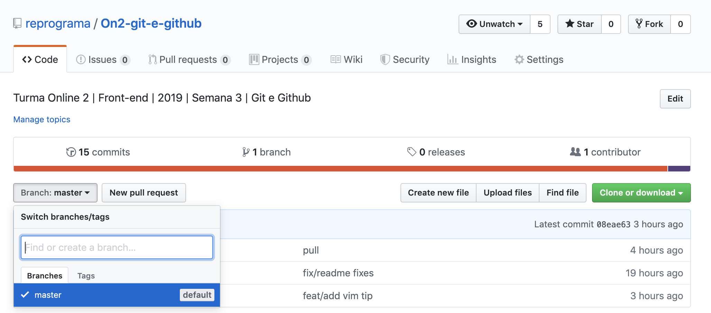

# Git e Github

### Instruções

##### Configurações básicas iniciais
* Ter o git instalado na sua máquina, vamos conferir se existe e qual a versão usando o comando:
	
  ```
  git --version
  ```
  * Caso não tenha, baixe pelo site: https://git-scm.com/downloads

* Abra o Git Bash (software de terminal de comando)

* Verifique se seu usuário está configurado na sua máquina. (Deve aparecer seu ***user.name*** e ***user.email***)
	
  ```
  git config --list
  ```

	* Caso não esteja configurado, fazer a configuração de ***user.name*** e ***user.email***
		
    ```
    git config --global user.name "Seu Nome"
    ```

    ```
    git config --global user.email "seu@email.com"
    ```

---

##### Clonar o repositório do exercício na sua máquina

* Entre no Git Bash

* Verifique se está no diretório (local) em que deseja clonar o repositório:
	
  ```
  pwd
  ```
  * Se não estiver, lembre de navegar para a pasta correta utilizando alguns comandos no [terminal](#comandos)


* Clonar o repositório desta aula aqui do Github
	
  ```
  git clone https://github.com/reprograma/On2-git-e-github.git
  ```

* Entrar nesse repositório (dentro do repo. da aula)

	```
  cd On2-git-e-github/exercicio-casa
  ```

* Criar uma branch nova com seu nome:
	
  ```
  git checkout -b suaBranch
  ```

***

### Exercício

* Dentro do arquivo Html na pasta exercicio-casa, alterar a imagem e o link para seu github na `<div>` que contiver seu nome.
	* Use o link do seu github para colocar no ***href*** na tag `<a>`. (Ex: https://github.com/reprograma)
	* Use o link da imagem do seu avatar no github para colocar no ***src*** da tag ``. Clique com o botão direito sobre a imagem do seu perfil no github e copie o endereço da imagem. (Ex: https://avatars0.githubusercontent.com/u/27314899?s=200&v=4)
  * Adicione seu nome no ***alt*** da tag ``

  Exemplo:

    **Antes:**

    ```
    <div class="container__aluna">
        <a href="#" target="_blank">
            
        </a>
        <p>Fulana Silva</p>
    </div>
    ```
    
    **Depois:**
    
    ```
    <div class="container__aluna">
        <a href="https://github.com/cintiafumi" target="_blank">
            
        </a>
        <p>Cintia Fumi</p>
    </div>
    ```

* Depois abra o html para conferir essa alteração no navegador (Chrome).
	* *Comportamento esperado: ao clicar na sua foto, o link do seu Github irá se abrir numa aba nova*

* Voltando para o Git Bash, verifique o status
	
  ```
  git status
  ```

* Adicionar as alterações para área de stage
	
  ```
  git add index.html
  ```

* Verificar o status novamente
	
  ```
  git status
  ```

* Adicionar mensagem de ***commit***
	
  ```
  git commit -m "adicionando foto e link de Cíntia Fumi para Githbub"
  ```

* Subir as alterações para o seu repositório remoto
	
  ```
  git push origin suaBranch
  ```

* Verificar se as alterações foram atualizadas na sua branch lá no Github (https://github.com/reprograma/On2-git-e-github), você pode verificar sua branch clicando em "branch: master" como mostra abaixo:



* Ainda no Github, ir para a aba ***Pull requests***

* Criar novo ***New pull request*** pelo Github verificando se está fazendo a solicitação da suaBranch para a master
	*base: **master**    **<=**    compare: **suaBranch***

***

##### Após todos ***pull requests*** dessa aula serem aceitos, vamos atualizar localmente seu repositório

* No Git Bash, voltar para a branch master
	
  ```
  git checkout master
  ```

* Atualizar o repositório local
	
  ```
  git pull origin master
  ```

* Verificar no navegador (Chrome) se todas as atualizações vieram

***

##### Agora bora deletar sua branch após seu ***pull request*** ser aceito

* Estar na branch **master** para remover a branch **suaBranch**
	
  ```
  git checkout master
  ```
	
  ```
  git branch -d suaBranch
  ```

***

##### Vamos subir no seu próprio Github?

* Criar um novo respositório no seu Github

* Copiar o link desse novo repositório e adicionar o remote ***meuRepo*** como endereço do seu repositório
    
  ```
  git remote add meuRepo https://github.com/<seuLogin>/<seuNovoRepositorio>.git
  ```

	Obs: Nesse link acima, substituir `<seuLogin>` e `<seuNovoRepositorio>` com informações do seu login e seu repositório
  
* Commitar o que está local para seu repo novo

  ```
  git commit -m "Exercício para casa" --allow-empty
  ```

* Subir o repo local para o seu repo
	
  ```
  git push origin master
  ```

***

### Comandos básicos do terminal <a name="comandos"></a>

```
ls - Listar (ele traz uma lista de tudo o que está naquela pasta - documentos, outras pastas, etc)
pwd - Present working directory (onde estou?) Ele traz todo o caminho onde você está (em que pasta e onde essa pasta fica)
cd - change directory (use para se locomover entre as pastas)
cd ~ - volta para a pasta raiz
cd . - volta uma pasta acima
cd nome-da-pasta - para entrar em uma pasta específica (você precisa conseguir enxergar ela quando listar os arquivos)
mkdir - make a directory, cria uma nova pasta. Precisa colocar o nome da nova pasta. Ex: mkdir nomePastaNova
echo - echo, cria um arquivo. Precisa indicar o conteúdo e o nome do arquivo. Ex: echo "oi" > index.html
```